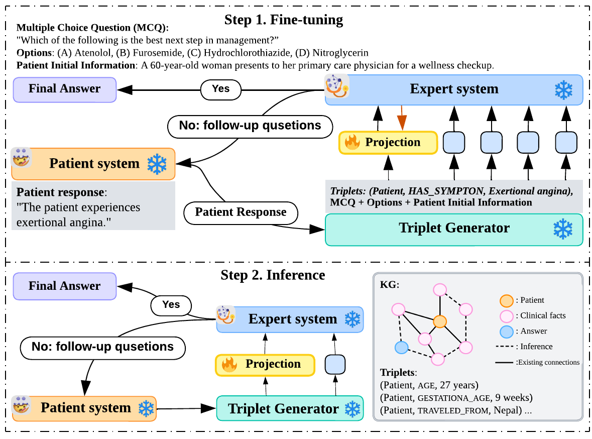

# TriMediQ: A Triplet-Structured Approach for Interactive Medical Question Answering

## 🚀 Overview
TriMediQ is an approach designed for interactive medical QA.  
It addresses the limitation of LLMs in interactive settings where clinical facts are scattered across dialogue turns without explicit connections.  

The approach introduces a **triplet-structured knowledge graph (KG)** that incrementally converts patient responses into UMLS-style triplets and integrates them into the expert LLM via a projection module.  

### TriMediQ operates in two stages:
1. **Projection Training**: Fine-tuning a projection module that encodes UMLS-style triplets via a graph encoder + projector and injects them into a frozen expert LLM through prefix tuning.
2. **Interactive QA**: Using the trained projection to support inference in multi-turn patient–expert interactions.

## 🧩 Framework


## 🔧 Installation

Create a new conda environment with all dependencies (requires GPU for PyTorch + CUDA):
```bash
conda env create -f environment.yml
conda activate TriMediQ
```

## ▶️ Running the Benchmark
Example run:
```bash
python TriMediQ_benchmark.py \
  --expert_module expert --expert_class ScaleExpert \
  --patient_module patient --patient_class FactSelectPatient \
  --data_dir ../data --dev_filename all_dev_good.jsonl \
  --output_filename out.jsonl --max_questions 10
```

## 📜 License
This repository is released under the MIT License.
